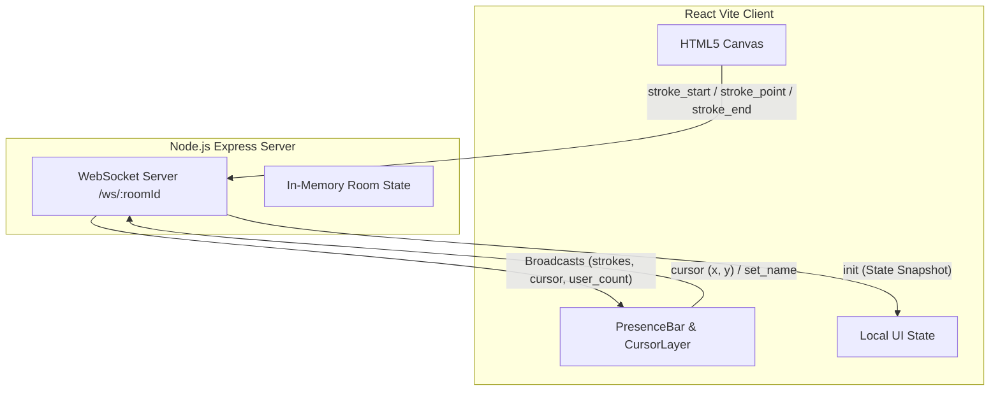

# Sketch.io — Real-time Collaborative Whiteboard

A multiplayer drawing canvas where every stroke syncs instantly over WebSockets. Built from scratch with React (Vite), Node.js (Express + ws), and HTML5 Canvas (no external canvas libraries).

---

## 🏗️ System Design



---

## ⚡ Features & Wire Protocol

- **Zero-latency Stroke Sync:** Drawn coordinates are normalized (0 to 1) and broadcast in <50ms.
- **Cursor Presence:** Throttled mouse position updates for all active users.
- **State Replay:** Late joiners or reconnecting clients automatically fetch the full canvas history.

---

## 🛠️ Quick Start

1. Install all dependencies:
   ```bash
   npm run install:all
   ```
2. Start both frontend and backend concurrently:
   ```bash
   npm run dev
   ```

- Frontend App will run on: [http://localhost:5173](http://localhost:5173)
- Backend API will run on: [http://localhost:7860](http://localhost:7860)

---

## ☁️ Deployment

- **Backend:** Deploy to [Railway](https://railway.com) or any Node host running `node backend/server.js`.
- **Frontend:** Deploy to [Vercel](https://vercel.com) or static hosts with the environment variable `VITE_WS_URL=wss://your-backend.up.railway.app`.
